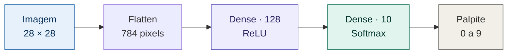
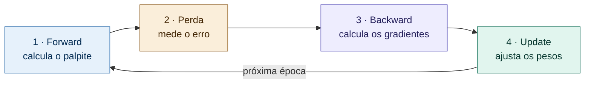
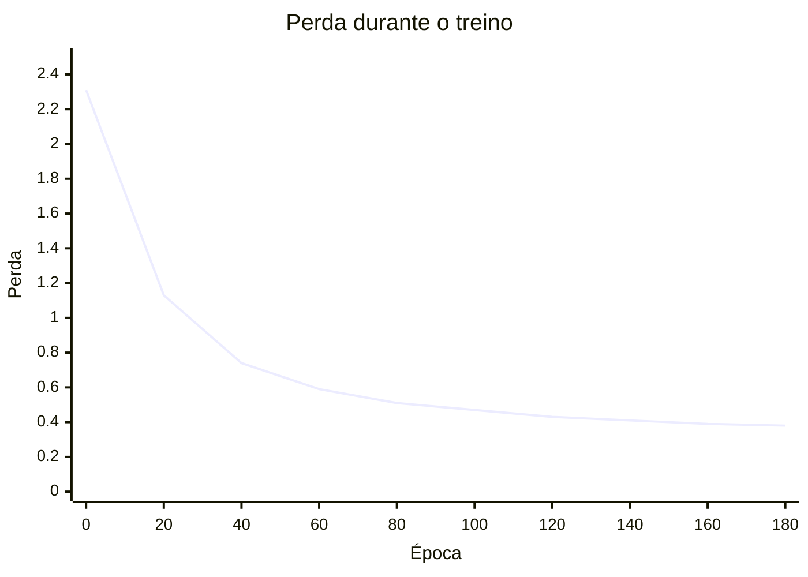

# 🧠 Rede Neural do Zero — Classificação de Dígitos (MNIST)
 
Uma rede neural **construída inteiramente à mão, em NumPy puro** — sem TensorFlow, sem Keras, sem PyTorch. O forward pass, a função de perda, o backpropagation e o gradiente descendente foram todos implementados do zero, para entender por dentro o que a maioria das bibliotecas trata como caixa-preta.
 
O modelo classifica dígitos manuscritos (0 a 9) do dataset MNIST e atinge **~90% de acurácia em imagens que nunca viu**.
 
---
 
## 🎯 Por que fazer sem biblioteca?
 
O objetivo nunca foi competir com o Keras (que chega a ~98% no MNIST). Foi **entender a mecânica**: como um modelo transforma pixels em decisão, como ele mede o próprio erro e como ajusta milhares de pesos sozinho até acertar. Cada linha aqui é uma peça que normalmente fica escondida atrás de um `model.fit()`.
 
---
 
## 🏗️ Arquitetura
 

 
| Camada | Entradas → Saídas | Ativação | Parâmetros |
|---|---|---|---|
| Flatten | 28×28 → 784 | — | 0 |
| Dense (oculta) | 784 → 128 | ReLU | 100.480 |
| Dense (saída) | 128 → 10 | Softmax | 1.290 |
 
---
 
## ⚙️ Como a rede aprende
 
O treino é um ciclo. A cada volta, a rede chuta, mede o erro, descobre a culpa de cada peso e se corrige um pouco. Repetido centenas de vezes, isso é o aprendizado.
 

 
| Etapa | O que faz | Conceito-chave |
|---|---|---|
| **Forward pass** | Passa a imagem pelas camadas até virar 10 probabilidades | Soma ponderada + ReLU + Softmax |
| **Cross-entropy** | Transforma o erro num único número | Pune com `-log` a probabilidade dada ao dígito certo |
| **Backpropagation** | Calcula a "culpa" (gradiente) de cada peso | Regra da cadeia, da saída de volta à entrada |
| **Gradiente descendente** | Empurra cada peso na direção que reduz o erro | `peso = peso − taxa × gradiente` |
 
---
 
## 📉 Resultados do treino
 
A perda começa em ~2.3 (uma rede que chuta 10% para cada dígito) e cai de forma contínua ao longo das 200 épocas:
 

 
| Métrica | Valor |
|---|---|
| Acurácia no **treino** | 89.9% |
| Acurácia no **teste** | **90.3%** |
| Perda inicial → final | 2.31 → 0.37 |
 
> **Sem overfitting:** treino e teste ficaram praticamente empatados (89.9% vs 90.3%). Isso indica que a rede aprendeu os *padrões* dos dígitos em vez de decorar as imagens — ela generaliza para dados novos.
 
---
 
## 🔍 Exemplo de previsões
 
A rede acerta a grande maioria e erra, quando erra, nos casos genuinamente ambíguos — um `5` muito rabiscado confundido com `6`, por exemplo. Os erros são "compreensíveis", não aleatórios.
 
```
Palpite: 7 ✓   Palpite: 2 ✓   Palpite: 1 ✓   Palpite: 0 ✓   Palpite: 4 ✓
Palpite: 1 ✓   Palpite: 4 ✓   Palpite: 9 ✓   Palpite: 6 ✗   Palpite: 9 ✓
```
 
---
 
## 🧩 Estrutura do código
 
| Função | Responsabilidade |
|---|---|
| `init_params()` | Cria os pesos com inicialização **He** (`√(2/n)`) |
| `forward(X, ...)` | Forward pass sobre um lote de imagens |
| `one_hot(y)` | Converte rótulos (`3`) em vetores (`[0,0,0,1,...]`) |
| `cross_entropy(A2, y)` | Calcula a perda |
| `backward(X, y, ...)` | Backpropagation — gradientes de todos os pesos |
| `train(X, y, ...)` | Loop de treino (forward → perda → backward → update) |
| `accuracy(X, y, ...)` | Fração de acertos |
 
---
 
## ▶️ Como executar
 
```bash
# Requisitos: numpy e matplotlib
pip install numpy matplotlib
```
 
```python
# Carrega o MNIST, normaliza e treina
X_train = x_train.reshape(-1, 784)
X_test  = x_test.reshape(-1, 784)
 
W1, b1, W2, b2 = train(X_train, y_train, epochs=200, lr=0.1)
 
print("Acurácia no teste:", accuracy(X_test, y_test, W1, b1, W2, b2))
```
 
O notebook completo roda direto no **Google Colab** (recomendado, pela GPU gratuita).
 
---
 
## 🚀 Próximos passos
 
- [ ] Substituir a camada densa por uma **rede convolucional (CNN)** — o salto natural para >99% no MNIST
- [ ] **Learning rate decay** — passo maior no início, refinado no fim
- [ ] Técnicas anti-overfitting (**dropout**, regularização) para redes maiores
- [ ] Exportar os pesos e servir o modelo num **app web** onde o usuário desenha o dígito
---
 
## 👤 Autor
 
**Pietro Ruotolo** — Engenharia de Software, FIAP
[github.com/PietroRuotolo](https://github.com/PietroRuotolo)
 
> Projeto de estudo construído para dominar os fundamentos de IA por dentro — a base para trabalhos posteriores com modelos de linguagem e agentes.
